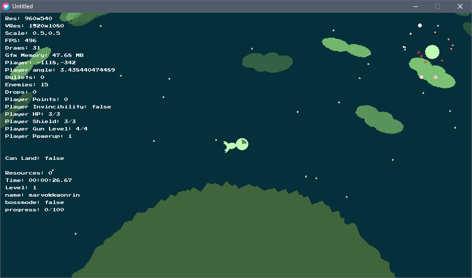

## Ship Game

### Note: for [Love 0.10.2](https://github.com/love2d/love/releases/tag/0.10.2).  It uses 0-255 colour values.

Fly a ship around a planet protecting it from hazards.

apologize up-front that it is a terrible unfinished mess! ;-)

## What this has
- Can handle any 16x9 resolution (or any? I can't remember :( ), runs at a virtual 1920x1080 resolution and scales to whatever you put in, you can also change the virtual resolution to whatever you want, like something smaller
- planet generation, including regions and slices, using law of cosine - the name is also random using preset chunks
- Play area rotates around the planet, with a day / night side, random-ish colour palette clouds and stars
- Chromatic abbrassion shader for visual damage indicator
- keyboard/mouse and gamepad controls
- a few different enemy types: stationary, orbit, sinwave orbit, and homing.  They all use the same sprite though, sorry for that too! :)
- A few different bullet types including linear and homing
- Rotating minimap that is a small version of the planet and the enemy positions
- Land at base, heal and upgrade weapons
- Basic level progression (by killing enemies), a boss and change to next level -> doesn't do much but increment some numbers at this point

## Keyboard & Mouse Controls:
- Movement - wsad keys
- Direction - mouse
- Shoot - left mouse
- Bomb - right mouse
- change weapons - mouse wheel
- land - space
- Pause menu / menu back - esc
- menu movement - wsad keys
- menu Ok - space

## Gamepad Controls:
- Movement - left stick
- Direction - right stick
- I can't recall the rest, check out the code :)

